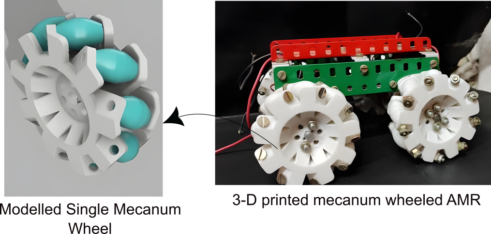

# Mecanum-wheel-AMR

Built a 3D-printed Mecanum-wheel AMR with four independently driven wheels, controlled via Raspberry Pi and a custom RC interface for holonomic motion.
Implemented a closed-loop PID velocity controller using L293D H-bridge drivers and geared DC motors to achieve stable torque–speed characteristics and precise omnidirectional manoeuvring.

Here is the completed Model of the AMR

  

All 3D-printable STL files used in this project are publicly available on Thingiverse:  
👉 [Thingiverse Model – 3D Printable Files](https://www.thingiverse.com/thing:4023557)
